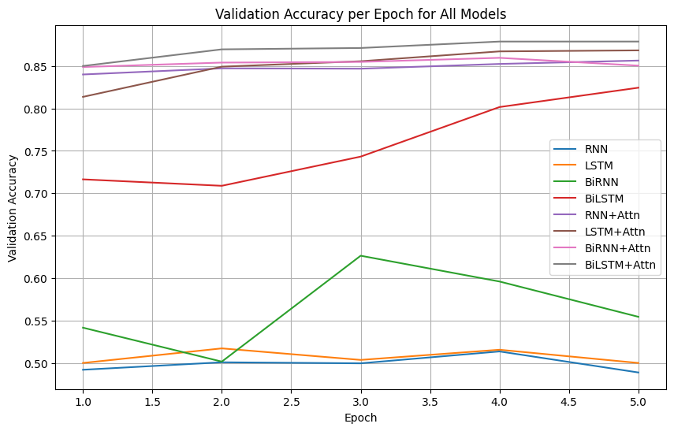
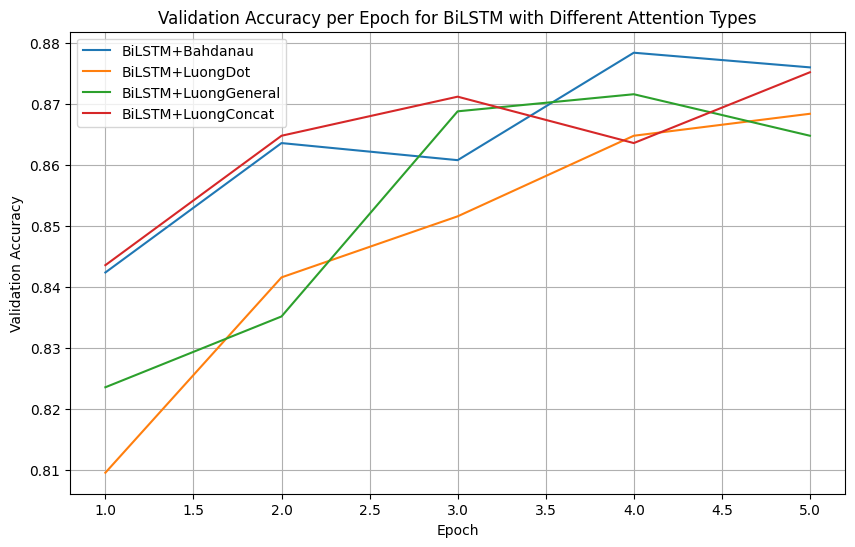
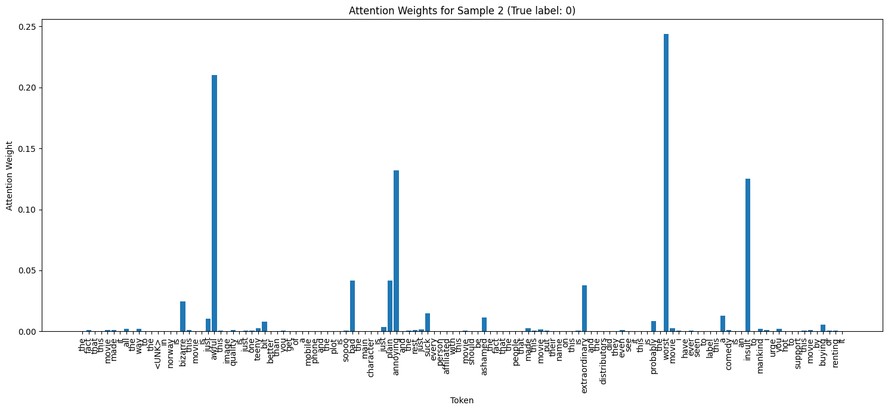

# Sentiment Analysis with Attention Mechanisms
Sentiment analysis is a key task in natural language processing (NLP) that involves classifying text into positive or negative sentiment. In this project, I explore various RNN-based models and attention mechanisms to improve sentiment classification on the IMDB dataset.

---

### 1. Project Structure
* attention.ipynb: Main notebook for data processing, model training, and evaluation.
* attention_modules/: Contains custom attention mechanism implementations.
* model/: Contains the SentimentRNN model definition.
* glove.6B/: Pre-trained GloVe embeddings for word representation. (didn't push it to github due its large size)

---

### 2. Embedding Layer
I use pre-trained GloVe 100d embeddings to initialize the embedding layer, allowing the model to leverage semantic word information.

---

### 3. Model Architectures
#### 3.1 Baseline Models
1. RNN
2. LSTM
3. BiRNN
4. BiLSTM
#### 3.2 Attention Mechanisms
1. Bahdanau Attention
2. Luong Dot Attention
3. Luong General Attention
4. Luong Concat Attention

---

### 4. Training and Evaluation setup
* Loss: CrossEntropyLoss
* Optimizer: Adam
* Batch size: 64
* Epochs: 5

---

### 5. Analysis

* Here we have RNN, LSTM, BiRNN and BiLSTM with and without attention.
* We can notice here RNN, LSTM, BiRNN have validation accuracies around $50\%$, which means there just guessing the data without actually learning anything.
* BiLSTM without attention performs better than former three and accuracy of around ~$84\%$.
* We see actual power of attention in the last 4 model.
* Even vanilla RNN with attention performs far better and reaches more than $85\
%$ accuracy. 
* Almost all the models give more than $85\%$ accuracy with attention maybe because the classification task is quite simple.
* Still BiLSTM + Attention performs slightly better than other models with attention.

* Here we have BiLSTM with different types of attention.
* We see all of them more or less give the same result.
* Although Bahdanau and LuongConcat attention perform slightly better than other models.

* Here we are trying to visualize the attention weights for the sentence:

    "the fact that this movie made it all the way to the <UNK> in norway is bizarre this movie is just awful this image quality is just one teeny bit better than you get of a mobile phone and the plot is soooo bad the main character is just plain annoying and the rest just suck every person affiliated with this movie should be ashamed the fact that the people that made this movie put their name on this is extraordinary and the distributors did they even see it this is probably the worst movie i have ever seen to label this a comedy is an insult to mankind i urge you not to support this movie by buying or renting it"

* If we read this sentence carefully we can observe words like "bizzare", "awful", "annoying", "worst" indicates that the movie is bad so they should carry more attention weight. If we try to print the top 10 words with respect to attention weights we get.

* Top 10 Attention Weights:
    1. worst: 0.2112
    2. awful: 0.2016
    3. insult: 0.0965
    4. soooo: 0.0524
    5. teeny: 0.0518
    6. bizarre: 0.0451
    7. annoying: 0.0404
    8. bad: 0.0403
    9. plain: 0.0397
    10. suck: 0.0366
* Here the attention weights makes complete sense!

### 6. Conclusion
* Attention mechanisms improve sentiment classification.
* BiLSTM with Bahdanau attention achieved the best results.
* Attention weights provide interpretability to model predictions.

### 7. References
- [Bahdanau, D., Cho, K., & Bengio, Y. (2014). Neural Machine Translation by Jointly Learning to Align and Translate.](https://arxiv.org/abs/1409.0473)
- [Pennington, J., Socher, R., & Manning, C. D. (2014). GloVe: Global Vectors for Word Representation.](https://nlp.stanford.edu/projects/glove/)
- [IMDB Dataset on Hugging Face](https://huggingface.co/datasets/imdb)